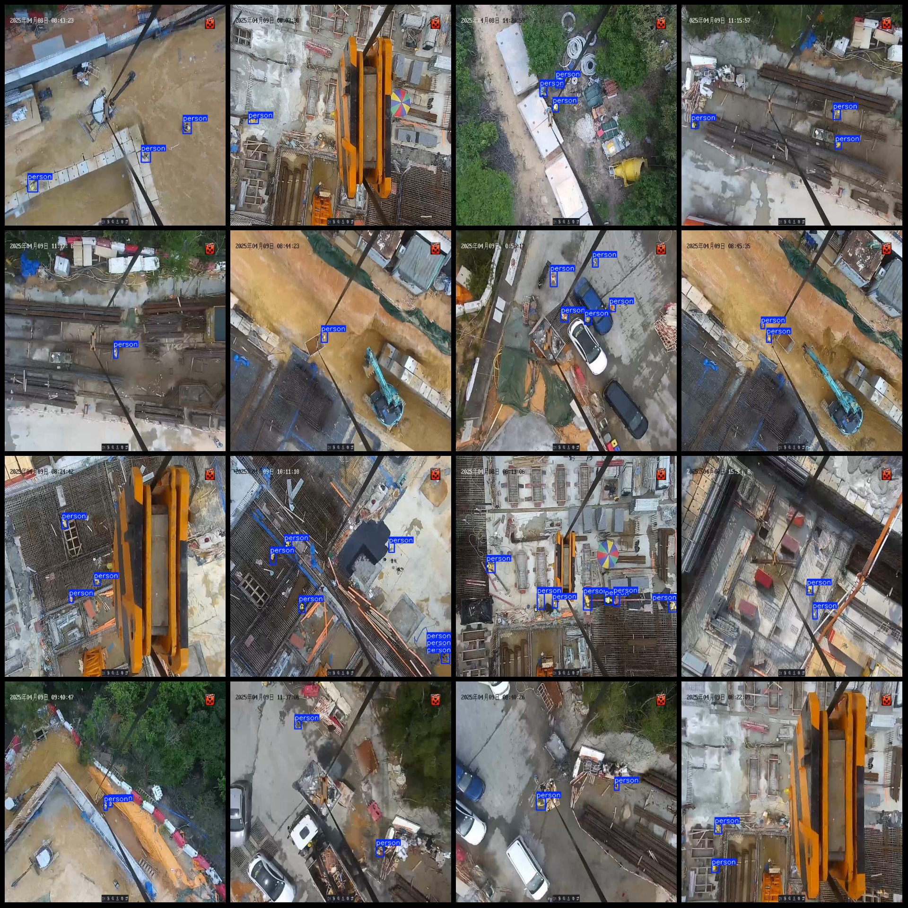
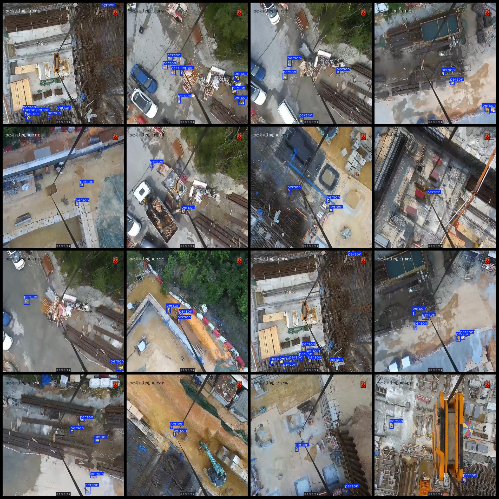

# Drone-Viewed Construction Site Personnel Detection Dataset - Pascal VOC+YOLO Format, 4058 Images in 1 Category

Dataset Format: Pascal VOC format + YOLO format (txt file without split path, only containing jpg images along with corresponding VOC format xml files and YOLO format txt files)

Number of Image Files (jpg count): 4058
Number of Annotation Files (xml count): 4058
Number of Annotation Files (txt count): 4058
Number of Annotation Categories: 1
Annotation Category Name: ["person"]
Number of Boxes per Category: 17686
Total Boxes: 17686
Image Resolution: 640x640
Drone: DJI MAVIC 3
Collecting Altitude: 50m
Collecting Angle: 90°
Annotation Tool Used: labelImg
Annotation Rules: Draw a rectangle around the category
Important Notes: No specific notes provided.
Special Disclaimer: This dataset does not guarantee the accuracy of the trained models or weight files.

Image Preview:
Annotation Example:

## Images

Here is a pay link on Stripe ( https://buy.stripe.com/3cs8yP7sY87d0vu9AB ). Please contact me lonlonago@foxmail.com after funding $89, and I will send you a complete data files , thank you!

